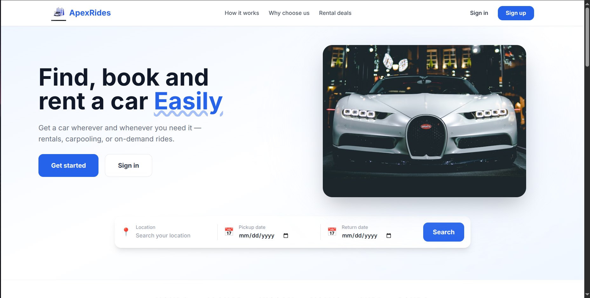
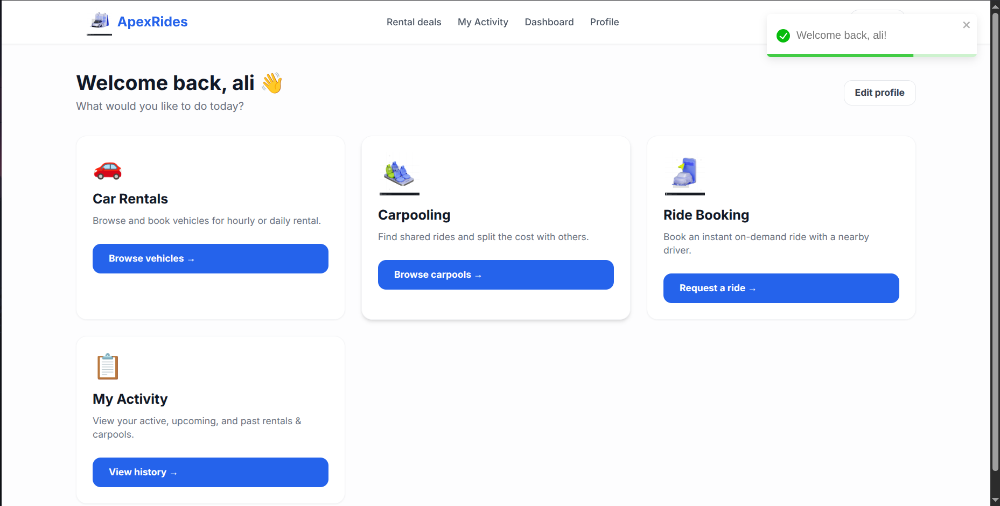
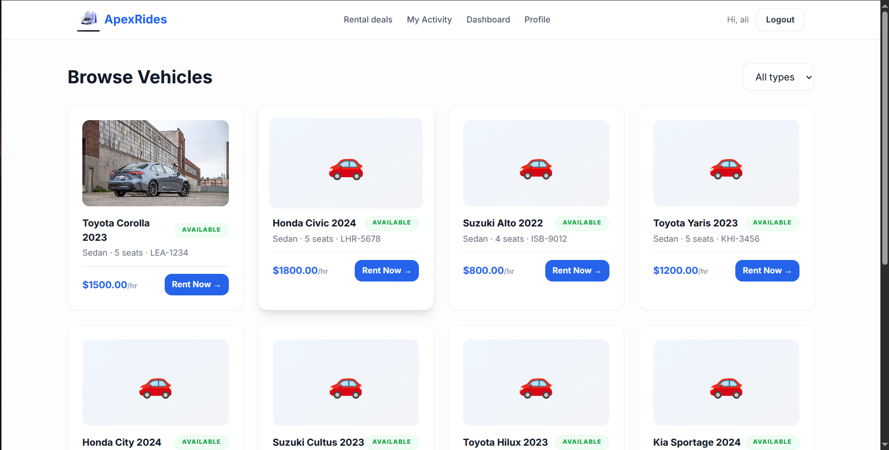

# ApexRides Project Documentation
# the project will soon be deployed and link will be in readme here after sometime and a few improvements/fixes

ApexRides is a platform that combines car rentals, carpooling, and ride requests into one easy-to-use website. It helps people find the transportation they need quickly and professionally.

Team Members: Anas(BSCS24155) and Mubeen(BSCS24063)
Group Number: 08

---

## 1. Project Overview
ApexRides is designed for urban mobility. It allows users to rent cars by the hour, share rides with others through carpooling, or book instant rides with a driver. It target homeowners, commuters, and travelers who need reliable vehicles.

## 2. Tech Stack
The project is built using:
- Frontend: React with Vite and CSS
- Backend: Node.js and Express
- Database: PostgreSQL
- Authentication: JWT (JSON Web Tokens)
- Image Management: Multer for handling file uploads

## 3. System Architecture
The application is split into three main parts. The frontend is what you see in your browser. It talks to the backend server to get and send information. The backend server then communicates with the PostgreSQL database to store and retrieve data like user profiles, vehicle details, and booking history.

## 4. UI Examples
Here are some of the main pages of the app:

## 5. Setup and Installation

Prerequisites:
- Node.js installed on your computer
- PostgreSQL database engine running

Steps to Install:
1. Open the backend folder and run: npm install
2. Open the frontend folder and run: npm install

Configuration:
Create a .env file in the backend folder with these details:
- PORT: 3000
- DB_HOST: localhost
- DB_NAME: rideshare_db
- DB_USER: your_database_username
- DB_PASSWORD: your_database_password
- JWT_SECRET: a_secret_code_for_security

Database Setup:
Run the following commands in your terminal to set up the data:
- psql -d rideshare_db -f Database/schema.sql
- psql -d rideshare_db -f Database/seed.sql

Starting the App:
- To start the backend: Run "npm start" in the backend folder.
- To start the frontend: Run "npm run dev" in the frontend folder.

## 6. User Roles and Login Info
Admin: Has full control over the system, including managing users and vehicles.
Login: admin.system@rideshare.pk / Password: admin123 (from seed.sql)

Driver: Can offer carpool seats and accept ride requests.
Login: bilal.hassan@yahoo.com / Password: password123 (from seed.sql)
If some error happens, signup an account as a driver

Customer: Can rent cars and book rides.
Login: ahmed.khan@gmail.com / Password: password123 (from seed.sql)
if some error happens, sign up as a customer 

## 7. Feature Walkthrough
- **Car Rentals:** Customers can browse available cars, view specifications, and rent them per hour. Admin can view and change the rental status when vehicles are returned.
  - *Role:* Customer / Admin
  - *API Endpoint:* `POST /api/v1/rentals`
- **Carpooling:** Drivers can offer empty seats on planned trips for a set price. Customers can browse open carpool offers and book seats cleanly.
  - *Role:* Driver / Customer
  - *API Endpoint:* `POST /api/v1/carpools/offers`, `POST /api/v1/carpools/bookings`
- **Instant Rides:** Customers can request immediate rides by providing pickup and dropoff locations. Real-time availability allows drivers to accept requests.
  - *Role:* Customer / Driver
  - *API Endpoint:* `POST /api/v1/ride-requests`

## 8. Database Transactions
ApexRides uses atomic database transactions to ensure that multiple operations either succeed together or fail completely without leaving the data in a messy state.

- Carpool Booking
Trigger: Customer clicks 'Book seats' on a carpool offer.
API Endpoint: POST /api/v1/carpools/bookings
Code File: backend/controllers/carpools.js (function: bookCarpool)
Operations: The system uses BEGIN to start a transaction. It first locks the carpool offer row (FOR UPDATE) to check seat availability accurately. It then inserts a new record into carpool_bookings, decrements the seats in carpool_offers, and creates a record in carpool_payments.
Rollback: The transaction rolls back if the seats being booked are more than what is available, if the user tries to book the same carpool twice, or if any database operation fails.

- Ride Booking
Trigger: Customer requests a driver for an immediate ride.
API Endpoint: POST /api/v1/rides
Code File: backend/controllers/rides.js (function: bookRide)
Operations: Starts a transaction to lock the vehicle row and check its availability. It then simultaneously creates a record in ride_bookings and a pending payment in ride_payments.
Rollback: The transaction will rollback if the vehicle was already marked as unavailable by another user or if the assigned driver is not found in the system.

- Rental Booking
Trigger: Customer confirms a vehicle rental for a specific date range.
API Endpoint: POST /api/v1/rentals
Code File: backend/controllers/rentals.js (function: createRental)
Operations: An atomic transaction locks the vehicle's availability row. It checks if the requested dates overlap with any existing bookings. If clear, it inserts records into rental_bookings and rental_payments.
Rollback: A rollback occurs if the vehicle is already booked for those dates, if the start date is in the past, or if the internal calculation for total amount fails.

## 9. ACID Compliance
ApexRides strictly enforces ACID properties for robust database scaling and operation:
- **Atomicity:** Ensured via `BEGIN`, `COMMIT`, and `ROLLBACK` blocks within controller transaction paths (e.g., `bookCarpool`, `createRental`). If any intermediate operation fails (such as updating seat capability), all preceding changes in that transaction are cleanly rolled back.
- **Consistency:** Maintained strictly through PostgreSQL triggers (e.g., `trg_rental_vehicle_availability`) that process automatic state changes, and explicit schemas containing `CHECK` constraints (e.g., preventing negative payment balances or negative available capacity).
- **Isolation:** Safely implemented using Row-Level Locking (`SELECT ... FOR UPDATE`), directly mitigating race conditions natively in the backend so two users cannot concurrently book the last carpool seat.
- **Durability:** Native PostgreSQL Write-Ahead Logging (WAL) architecture protects data persistence ensuring that when transactions natively hit `COMMIT`, the data is persistently stored and avoids loss during process disruptions.

## 10. Integrity and Performance
We use database triggers to automatically manage vehicle availability. When a trip or rental is completed, the vehicle is instantly marked as available again. We have also added numerous performance indexes to make sure that searching for data is extremely fast.

List of Database Indexes:
users_email_search_index
users_active_status_index

user_roles_lookup_by_user_index
user_roles_lookup_by_role_index

vehicles_availability_status_index

ride_requests_status_idx
ride_requests_customer_idx
ride_requests_driver_idx
ride_requests_created_at_idx

rentals_customer_history_index
rentals_vehicle_history_index
rentals_status_filter_index
rentals_date_range_lookup_index

rides_customer_history_index
rides_driver_history_index
rides_vehicle_history_index
rides_status_filter_index

carpools_driver_offers_index
carpools_vehicle_offers_index
carpools_status_filter_index

carpool_bookings_offer_lookup_index
carpool_bookings_passenger_lookup_index

rental_payments_user_index
rental_payments_rental_index

ride_payments_user_index
ride_payments_ride_index

carpool_payments_user_index
carpool_payments_booking_index

reviews_from_reviewer_index
reviews_to_reviewee_index
reviews_vehicle_feedback_index

The performance can be analyzed through performance.sql file

## 11. API Summary
only some are given
- Register: POST /api/v1/auth/register
- Login: POST /api/v1/auth/login
- List Vehicles: GET /api/v1/vehicles
- Create Carpool: POST /api/v1/carpools/offers
- Get Revenue: GET /api/v1/analytics/summary

## 12. Known Issues and improvements
- The ride booking logic need to be impoved, by adding real time updates etc
- The frontend can be better by adding more feautures and a better ui
- The system analytics need improvement and better UI
- Some styling warnings may appear in development tools, which do not affect the website's performance.
- Fare estimates are currently based on the distance between location names(just a lazy sol, will be improved in future).
